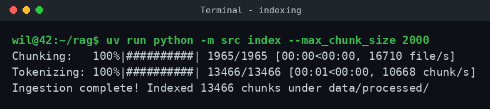
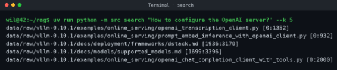

# RAG_Against_the_Machine

## To do

- Se rememorer le fonctionnement d'UV
- Se renseigner sur python fire et les progress bar (tqdm)
- // Le fonctionnement de BM25 et recall@k
- Faire le makefile 

## Etapes

- Decouper les fichiers utiles en chunks et les indexer
- L'indexation du corpus doit prendre 5 min max
- Les fichiers python et les fichiers markedown s'index differement, donc avoir deux methodes de chunking differentes
(Python = code chunking / Markedown = Text chunking)
- Utiliser BM25
- La taille des chunks est configurable en argument CLI le max doit etre 2000, sinon la moulinette rejette

Exemple de ligne de commande:  


## Fonctionnement

- On donne une question, et le system retourne le top-k des extrait les plus susceptible de repondre a la question en retournant l'index de debut et de fin  


- Une fois les extraits selectionné, le systeme les donnent à QWEN (dans sa limite de token), pour generer une reponse en langage naturel, et genere un JSON structure a un modele pydantic  

## Les Classes
```python
class MinimalSource(BaseModel):
    file_path: str
    first_character_index: int
    last_character_index: int
``` 
MinimalSource est la seul source d'info entre les stages  
```python
class UnansweredQuestion(BaseModel):
    question_id: str = Field(default_factory=lambda:
    str(uuid.uuid4()))
    question: str
class AnsweredQuestion(UnansweredQuestion):
    sources: List[MinimalSource]
    answer: str
```
Ces deux classes representes des question repondus et non repondus  
```python
class RagDataset(BaseModel):
    rag_questions: List[AnsweredQuestion | UnansweredQuestion]
``` 
RagDataset represente un ensemble de questions  
```python
class MinimalSearchResults(BaseModel):
    question_id: str
    question: str
    retrieved_sources: List[MinimalSource]
class MinimalAnswer(MinimalSearchResults):
    answer: str
```  
Represente la recherche et le resultat  
```python
class StudentSearchResults(BaseModel):
    search_results: List[MinimalSearchResults]
    k: int
class StudentSearchResultsAndAnswer(BaseModel):
    search_results: List[MinimalAnswer]
    k: int
```
C'est la recherche de resultat et de reponse


## Resultat

- Le system doit avoir 80% de reussite sur les questions de documents, et 50% sur les questions sur le code

- Qwen a des limites, donc sa reponse doit etre coherente, s'appuyer sur les documents, meme si elle est incomplete a cause de ses limites

## Output

- Chaque commandes ecrit un fichier JSON

### Pour l'operation de recherche

- Il faut utiliser StudentSearchResults

### Pour la generation de reponse

- Il faut utiliser StudentSearchResultsAndAnswer

### Pour la source d'information

- Il faut utiliser MinimalSource

### Format de sortie

- Il faut resecter le base du modele donne mais on peut l'ameliorer  
```json
"search_results": [
  {
    "question_id": "q1",
    "question": "How to configure OpenAI server?",
    "retrieved_sources": [
  {
    "file_path": "data/raw/vllm-0.10.1/docs/serving/openai_compatible_server.md",
    "first_character_index": 9867,
    "last_character_index": 10100
  },
  {
    "file_path": "data/raw/vllm-0.10.1/vllm/entrypoints/openai/api_server.py",
    "first_character_index": 267,
    "last_character_index": 400
  }
 ]
}
],
"k": 10
```

- Pour les reponses on doit respecter le modele de la classe StudentSearchResultsAndAnswer  
```json
"search_results": [
  {
    "question_id": "q1",
    "question": "How to configure OpenAI server?",
    "retrieved_sources": [
  {
    "file_path": "data/raw/vllm-0.10.1/docs/serving/openai_compatible_server.md",
    "first_character_index": 9867,
    "last_character_index": 10100
  },
  {
    "file_path": "data/raw/vllm-0.10.1/vllm/entrypoints/openai/api_server.py",
    "first_character_index": 267,
    "last_character_index": 400
  }
 ],
 "answer": "To configure the OpenAI compatible server in vLLM..."
}
],
"k": 10
```

## Command Line Interface (CLI)

- Il doit etre fait avec Python Fire
- Toutes les commendes doivent etre implementer avec :  
```shell
uv run python
-m src <command> [options]
```
- Les commandes sont:
    - index –max_chunk_size <int>  
    Prends les données dans data/raw et construit l'index dans data/processed
    - search <query> –k <int>  
    Retourne le top-k des sources pour une requete
    - search_dataset –dataset_path <path> –k <int> –save_directory <dir>  
    Recherche sur l'ensemble des donnees et retourne StudentSearchResults en fichier JSON
    - answer <query> –k <int>  
    Reponds a une seul requete a l'aide du contexte
    - answer_dataset –student_search_results_path <path> –save_directory <dir>  
    Genere des reponses pour un dataset et retourne StudentSearchResultsAndAnswer en fichier JSON
    - evaluate –student_search_results_path <path> –dataset_path <path>  
    Retourne notre Recall@k en s'appuyant sur le dataset pour nos tests

- Les chemins d'input et d'output doivent etre configurable en argument dans notre CLI et ne doivent pas etre hardcoder
- Integrer une barre de progression (tqdm)
- Gerer les mauvais inputs (requête vide, requête incohérente, k=0, fichiers manquants, JSON mal formé)
- Il ne doit pas crash avec une traceback non gere

## Workflow

- Les commandes lancee a la correction sont:
```shell
index –max_chunk_size <int>
```
puis
```shell
search_dataset –dataset_path <path> –k <int> –save_directory <dir>
```
Et enfin
```shell
uv run python -m moulinette evaluate_student_search_results \

    <student_results_path> \

    <dataset_path> \

    [--k K] \

    [--max_context_length MAX_LENGTH]
```

- L'arboresence du dossier doit etre:

```plaintext
.
├── data/
│   ├── datasets/
│   │   ├── AnsweredQuestions/
│   │   └── UnansweredQuestions/
│   ├── output/
│   │   ├── search_results/
│   │   │   └── <DatasetScope>/
│   │   └── search_results_and_answer/
│   │       └── <DatasetScope>/
│   ├── processed/
│   └── raw/
├── src/
├── .gitignore
├── pyproject.toml
├── README.md
└── uv.lock
```

- Au lieu de cibler un dossier générique comme --save_directory data/output/search_results/, il faut organiser les sorties de cette façon :

    Pour le jeu UnansweredQuestions :
    --save_directory data/output/search_results/UnansweredQuestions/

    Pour le jeu AnsweredQuestions :
    --save_directory data/output/search_results/AnsweredQuestions/

## Bonus

- Je pense faire le 1-2

### 1. Caching (Le plus simple)
* **Description :** Mettre en cache l'index et les résultats des requêtes pour accélérer le démarrage à froid et les recherches répétées.
* **Pourquoi c'est le plus simple :**
  * Il s'agit principalement de sauvegarder/charger des structures de données Python sur le disque (avec `pickle` ou `json`) ou d'utiliser un système de cache simple (comme `functools.lru_cache` ou la bibliothèque `diskcache`).
  * Aucune logique algorithmique complexe ni modèle d'IA supplémentaire n'est requis.

---

### 2. Local HTTP API
* **Description :** Exposer la recherche dans l'index et la génération de réponses via une petite API HTTP locale au lieu de passer uniquement par la CLI.
* **Pourquoi c'est très accessible :**
  * S'implémente très rapidement en Python avec un framework comme **FastAPI** ou **Flask**.
  * Les modèles de données Pydantic existant déjà pour la partie obligatoire (ex: `MinimalSearchResults`, `MinimalAnswer`), il suffit d'encapsuler la logique de tes fonctions CLI dans 2 ou 3 routes (`POST /search`, `POST /answer`).

---

### 3. Incremental indexing
* **Description :** Lorsqu'un fichier est modifié, ré-indexer uniquement ce fichier au lieu de reconstruire l'index entier.
* **Pourquoi c'est de difficulté intermédiaire :**
  * Nécessite d'effectuer un suivi d'état de l'indexation (stockage d'un hash `MD5`/`SHA256` ou de la date de modification `mtime` de chaque fichier).
  * Implique une logique de mise à jour ciblée : identifier les fichiers modifiés, supprimés ou ajoutés, purger leurs anciens *chunks* dans l'index puis ré-insérer uniquement les nouveaux.

---

### 4. Semantic embeddings
* **Description :** Ajouter un index vectoriel généré par un modèle CPU léger (type `all-MiniLM-L6-v2`) en complément de l'index lexical (TF-IDF/BM25).
* **Pourquoi c'est plus complexe :**
  * Nécessite d'intégrer une bibliothèque de vectorisation / recherche vectorielle (ex: `sentence-transformers` avec `faiss` ou `chromadb`).
  * Il faut gérer l'encodage des *chunks* en vecteurs (calcul CPU), la persistance des index vectoriels et le calcul de similarité (ex: similarité cosinus).

---

### 5. Hybrid retrieval (Le plus exigeant)
* **Description :** Combiner les classements lexical (BM25/TF-IDF) et sémantique (embeddings) en une seule liste de résultats unifiée.
* **Pourquoi c'est le plus difficile :**
  * Dépend directement du bonus *Semantic embeddings* (les deux index doivent être fonctionnels).
  * Exige de fusionner deux métriques aux échelles de scores hétérogènes (score BM25/TF-IDF vs similarité vectorielle). Cela implique d'implémenter un algorithme de fusion de rangs, tel que le **RRF (Reciprocal Rank Fusion)**, ou une combinaison linéaire pondérée et normalisée des scores.